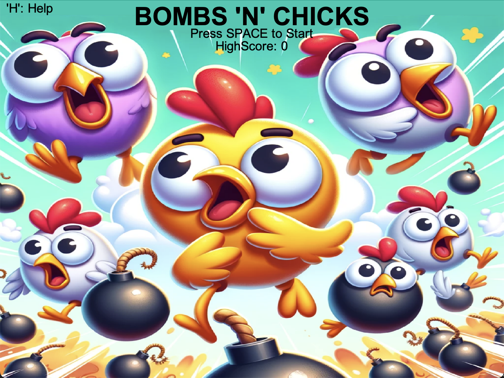
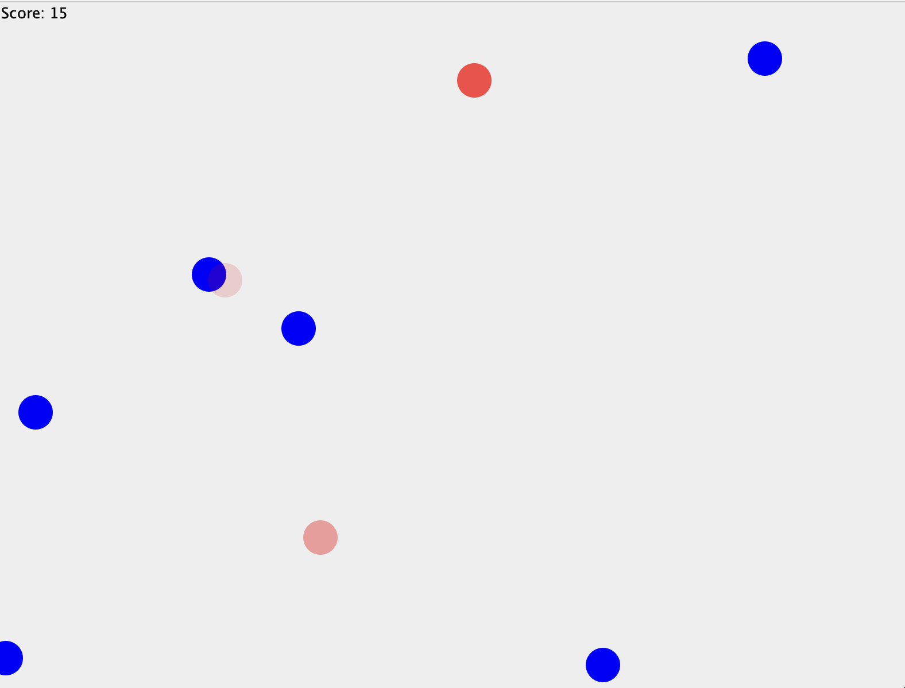

# BOMBS 'N' CHICKS Game

## Introduction

BOMBS 'N' CHICKS is a fun Java-based game where players must click on chickens and avoid bombs. The game features random spawns, sounds, and interactive gameplay.

## Gameplay

- Click on Bombs before they detonate to gain points.
- Be aware to not squash any chickens.
- Survive as long as possible to beat your highscore.

## Visual Demonstration

  
  

## Installation

TODO.

## Features

- Dynamic spawning of bombs and chickens.
- Main menu, game over and help screens.
- Score tracking.
- Increased difficulty over time.

## Development

Written in Java, using Java Swing for the GUI and Java Sound API for the sound handling.

## Licensing

This project is licensed under the MIT License. This allows others to use, modify, and distribute this software without restriction.

For full details, please see the [LICENSE](./LICENSE) file in the repository.
